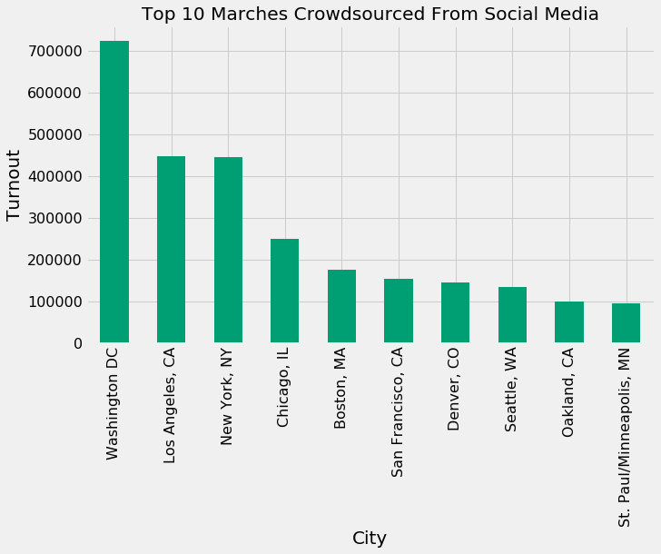
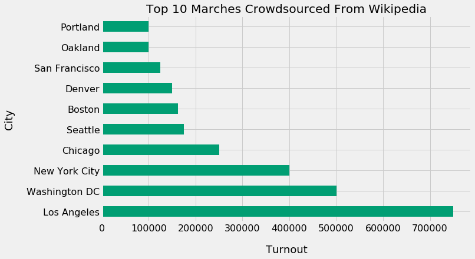
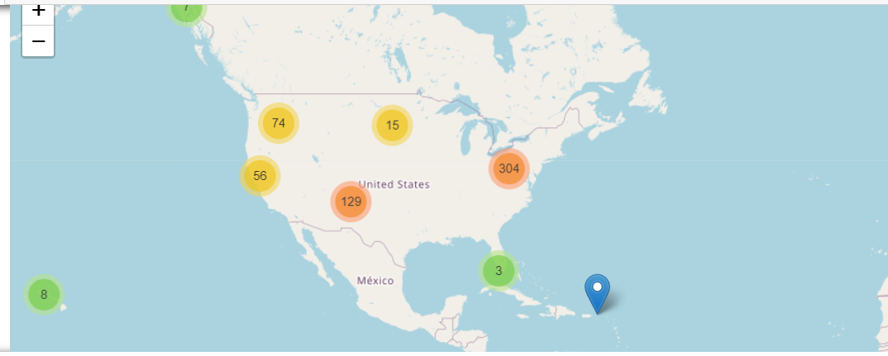

# Women_march
Women’s Marches that occurred in January 2017

# Steps 

I am uploding Jupyter notebook file which include all the steps.You just need to dwonload all csv files and notebook file.
Jupyter Notebook file womenmarch.ipynb

# output

State wise Graph

Map 

